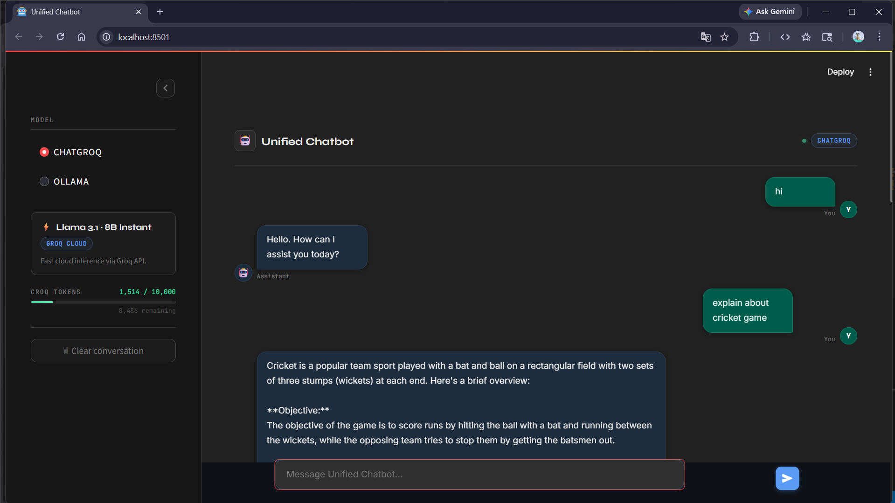

# Unified Q&A Chatbot (Groq & Ollama):

## Overview:
The **Unified Q&A Chatbot** is a Streamlit-based conversational AI application that allows users to interact with multiple Large Language Model (LLM) backends through a single interface. It currently supports **Groq-powered models** and **Ollama local models**, with seamless switching between them.

This project is designed for experimentation, comparison, and flexible deployment of LLM-based question–answering systems.

---



## Features
- 🔁 Unified interface for multiple LLM backends
- ⚡ Groq API integration for fast inference
- 🧠 Ollama support for local/offline models
- 🖥️ Interactive Streamlit web UI
- 🔀 Runtime model switching
- 📦 Modular and extensible architecture

---

## Project Structure
```
Unified-Q-A-Chatbot-Groq-Ollama--main/
│
├── streamlit_app.py      # Main Streamlit application
├── chatgroq_model.py     # Groq API model wrapper
├── ollama_model.py       # Ollama local model wrapper
├── switch_model.py       # Model selection and routing logic
├── requirements.txt      # Python dependencies (recommended)
└── README.md             # Project documentation
```

---

## Installation

### Prerequisites
- Python 3.9+
- pip
- (Optional) Ollama installed locally
- Groq API key

### Setup
```bash
git clone https://github.com/ash-iiiiish/Unified-Q-A-Chatbot-Groq-Ollama-
cd Unified-Q-A-Chatbot-Groq-Ollama
pip install -r requirements.txt
```

---

## Configuration

### Groq
Set your Groq API key as an environment variable:
```bash
export GROQ_API_KEY="your_api_key_here"
```

### Ollama
Ensure Ollama is installed and running:
```bash
ollama serve
```
Pull a model if needed:
```bash
ollama pull llama3
```

---

## Usage
Run the Streamlit app:
```bash
streamlit run streamlit_app.py
```

Open your browser at:
```
http://localhost:8501
```

Select your desired model backend (Groq or Ollama) and start chatting.

---

## How It Works
- `streamlit_app.py` handles the UI and user interaction
- `switch_model.py` routes prompts to the selected backend
- `chatgroq_model.py` communicates with Groq-hosted models
- `ollama_model.py` communicates with locally hosted Ollama models

---

## Extending the Project
You can easily add support for new LLM providers by:
1. Creating a new model wrapper file
2. Implementing a standard `generate_response()` function
3. Registering it in `switch_model.py`

---

## Troubleshooting
- **App not starting**: Ensure all dependencies are installed
- **Groq errors**: Verify API key and internet connection
- **Ollama not responding**: Check that Ollama is running locally

---

## 👨‍💻 Contributors
- [@ash-iiiiish](https://github.com/ash-iiiiish)

## License
This project is licensed under the MIT License. Feel free to use, modify, and distribute...........

